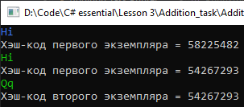

# Lesson3_addition_task
Условия задачки:
>Используя Visual Studio, создайте проект по шаблону Console Application.  
Требуется:  
Создайте класс Printer.  
В теле класса создайте метод void Print(string value), который выводит на экран значение аргумента.  
Реализуйте возможность того, чтобы в случае наследования от данного класса других классов, и вызове соответствующего метода их экземпляра, строки, переданные в качестве аргументов методов, выводились разными цветами.  
Обязательно используйте приведение типов.

От себя:
>Программа выдаёт warning CS0108	'DerivedPrinter.Print(string)' hides inherited member 'Printer.Print(string)'. Use the new keyword if hiding was intended.

Подытог: вот такенный майндфак на выходе
>
